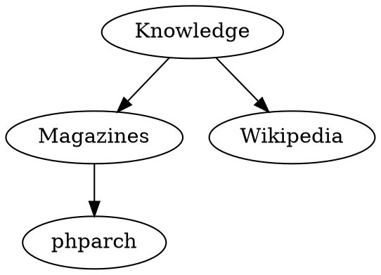
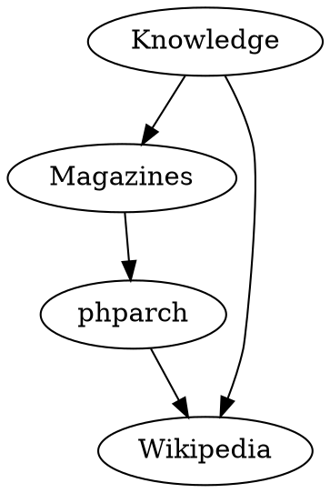
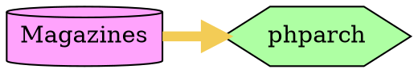
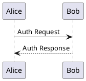
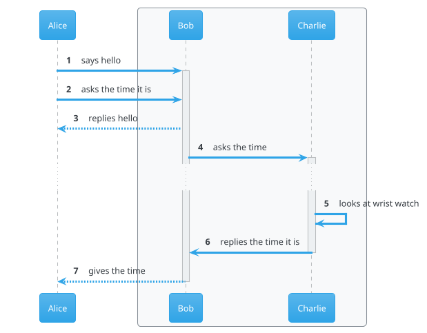
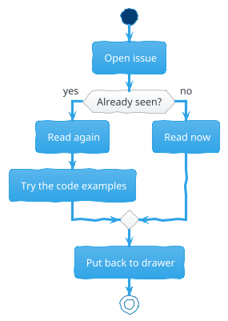
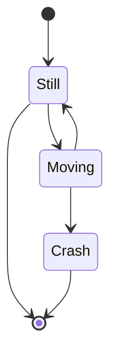
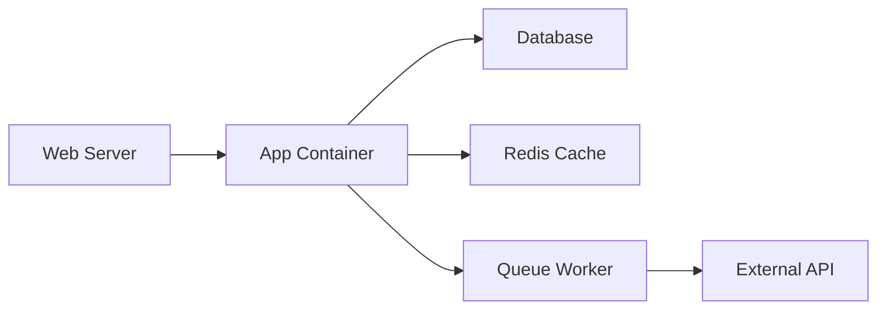
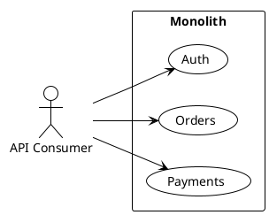

Every PHP project has that one wiki page with a diagram. It was drawn once, looked great on a whiteboard, someone photographed it, uploaded it, and nobody has updated it since. The code has been refactored three times, but the picture still shows the old architecture. Diagrams stored in wikis or shared drives rot. They rot because they're disconnected from the source code they describe.

The solution is simple: treat diagrams like code. Write them in a domain-specific language, store them alongside your PHP source files, version them with Git, and render them automatically. This is Diagram as Code.

In this guide you will learn:

- Why diagrams belong in your repository
- How to use Graphviz for quick relationship graphs
- PlantUML for standards-compliant UML diagrams
- MermaidJS for browser-rendered, interactive diagrams
- Kroki as a unified rendering API for 20+ engines
- IDE integration with VS Code and PhpStorm
- How to embed diagrams in PhpDocumentor output
- A production-ready CI pipeline for automated rendering

## The Problem with Traditional Diagrams

The documentation of source code and APIs has moved to the source files themselves. Tools like PhpDocumentor extract DocBlocks to keep manual and code in sync without duplicating effort. But a good drawing is worth more than a long paragraph, and drawings have been left behind.

Where do you keep the diagram? The project wiki? A shared drive? An image file committed to Git? None of these work well. Binary image files are opaque to diffs. You cannot review a PNG change in a pull request. Wikis drift from the codebase because there is no mechanical link between them.

At the end of the 90s, "software engineering workshops" analyzed source code to produce UML diagrams automatically, or let designers draw diagrams that generated code. Those tools fell out of favor, but the idea never died. In the era of Git repositories, README files living alongside code, and embedded comment blocks for documentation generation, the time has come to switch to Diagram as Code.

## What Is Diagram as Code?

Given a collection of standardized diagram types — class hierarchies, sequence diagrams, entity-relations, Gantt charts, pie charts — the idea is to describe what must be presented graphically using textual and readable directives. A rendering engine produces the best possible plot, handling layout and formalism automatically to accommodate the diagram's constraints.

Think of it as Markdown for diagrams. Markdown produces HTML from human-readable symbols inside source text. Diagram as Code produces SVG, PNG, or PDF from textual descriptions of graphs, flows, and structures.

## Graphviz: The Foundation

Graphviz has been serving for over 30 years as the engine that plots graphs from text primitives. It describes the essence of a graph: a list of states and transitions.



Render this with the `dot` command:

```bash
dot -Tsvg -o fig1.svg diagram.txt
```

Graphviz handles layout automatically. Add a new edge and the engine recalculates everything to minimize crossing and save space:



Customization is possible through attributes — colors, shapes, line thickness, direction:



The key insight is that you do not specify x,y coordinates or arrow curves. You describe the *what*, and the engine decides the *how*. This is the core principle of Diagram as Code.

Graphviz is a low-level tool, though. For standardized software documentation, you want something that understands UML conventions out of the box.

## PlantUML: UML for the JVM Ecosystem

PlantUML provides an abstraction layer for writing UML diagrams with a high-level DSL. It encapsulates the complexity of plotting every UML element — participant boxes, timelines, activation bars — while you focus on content.

Under the hood PlantUML uses Graphviz for certain plot types, but you never interact with it directly.

### Getting Started with PlantUML

Download the JAR and run it against your PHP source files:

```bash
java -jar plantuml.jar -o "docs/" -pdf "src/**.php"
```

This scans every `.php` file in `src/`, detects diagram definitions inside comments, and produces a PDF for each. You can also generate PNG or SVG.

### Writing Diagrams in DocBlocks

A minimal sequence diagram looks like this, placed directly in a PHPDoc comment:



Stripped down as it seems, this draws a fully standards-compliant sequence diagram with participant boxes, timelines, and arrows. The engine handles everything.

### Themes and Customization

PlantUML ships with about twenty predefined themes. Switch themes with a single directive:



The `!theme cerulean` line changes the color palette. The `autonumber` directive numbers every call automatically. The `box` and `end box` draw a responsibility group rectangle around Bob and Charlie.

### Activity Diagrams for Workflows

Activity diagrams are ideal for explaining algorithms and business workflows:



The `skinparam handwritten true` directive gives the diagram a hand-drawn sketch style. The DSL infers diagram type from keywords like `start`, `if`, and `stop`.

### Extensibility: Includes, Macros, and Icon Libraries

PlantUML supports `!include` directives that can pull definitions from local files or remote URLs. An entire ecosystem of icon libraries exists for AWS, Azure, and other vendors:

```plantuml
@startuml

' Import the libraries
!define AWSPuml https://raw.githubusercontent.com/awslabs/aws-icons-for-plantuml/v11.1/dist
!includeurl AWSPuml/AWSSimplified.puml
!includeurl AWSPuml/General/Users.puml
!includeurl AWSPuml/ApplicationIntegration/APIGateway.puml
!includeurl AWSPuml/Compute/Lambda.puml
!includeurl AWSPuml/Database/DynamoDB.puml
!includeurl AWSPuml/Compute/EC2.puml
!includeurl AWSPuml/Storage/SimpleStorageService.puml

' Theme and styles
!theme metal
skinparam defaultTextAlignment center
skinparam arrowThickness 1.5
skinparam arrowColor black

' Construction of the objects
Users(visitors, "Visitors", "")

cloud AWS {
  APIGateway(api, "Upload API", "")
  Lambda(lambda, "Converter Lambda", "")
  DynamoDB(storyDb, "Story Data DynamoDB", "")
  EC2(ec2, "Extractor EC2", "")

  rectangle {
    SimpleStorageService(s3, "S3", "")
    folder thumbnails
    folder videos
  }
}

interface "https" as apiEndpoint
interface "https" as cdnEndpoint

visitors -> apiEndpoint : "Upload a Story"
api -> lambda : "Trigger cropping / conversion"
lambda --> videos : storage
videos --> ec2
ec2 -> storyDb : "insert metadata"
ec2 -> thumbnails : storage
visitors <-> cdnEndpoint : "browse the images"

@enduml
```

The result is a professional-grade AWS architecture diagram drawn entirely from code within a PHPDoc comment block.

## MermaidJS: JavaScript-Native Diagrams

MermaidJS takes a different approach. Written in JavaScript, it runs in the browser and renders diagrams as SVG on the client side. It supports UML models (sequence, class, entity-relation, state) and non-UML types (pie charts, Gantt, git graphs).

### Embedding in HTML

```html
<html>
<body>
<div class="mermaid">
  pie
  title Popular Languages
    "PHP" : 142
    "Java" : 87
    "Python" : 58
    "Rust" : 14
</div>

<script src="https://cdn.jsdelivr.net/npm/mermaid/dist/mermaid.min.js"></script>
<script>mermaid.initialize({startOnLoad:true});</script>
</body>
</html>
```

Opening this file in a browser produces a rendered pie chart. The library detects all `div` elements with the `mermaid` class and transforms them in place.

### Native GitLab Integration

MermaidJS is bundled natively with GitLab. Any Markdown fenced code block with the `mermaid` language tag renders automatically — in README files, wiki pages, issue descriptions, and merge requests:



This means there is no reason to upload a binary image for technical documentation in a GitLab project. Write the diagram inline, and GitLab renders it.

### Mermaid Interactivity

MermaidJS supports a full JavaScript API for live data manipulation and callbacks on clicks and hovers. This makes it suitable for interactive documentation where readers can explore system behavior dynamically.

## Kroki: One API to Rule Them All

Maintaining separate toolchains for PlantUML, MermaidJS, Bytefield, Nomnoml, WaveDrom, and ERD is impractical. Kroki solves this by providing a unified HTTP API that supports 20+ diagram engines.

Send a POST request with your diagram snippet and the engine name; receive an SVG back:

```bash
curl -X POST \
  -H "Content-Type: text/plain" \
  -d 'digraph { PHP -> Documentation; Documentation -> Diagrams }' \
  https://kroki.io/graphviz/svg -o diagram.svg
```

Kroki supports on-premise deployment via Docker for teams that cannot send code to external services:

```bash
docker run -d -p 8000:8000 yuzutech/kroki
```

Then point your requests at `http://localhost:8000`. This is particularly relevant for enterprise PHP projects with compliance requirements.

## IDE Integration

### VS Code

The Markdown Preview Mermaid Support extension renders Mermaid diagrams inside Markdown preview windows. The PlantUML VS Code Extension provides live preview for PlantUML blocks — you type the DSL and see the diagram update in real time.

### PhpStorm

The PlantUML Integration plugin for JetBrains IDEs offers the same live preview. You can edit PlantUML diagrams in `.puml` files or within DocBlocks and see the rendered result in a side panel.

Both extensions can use a local PlantUML JAR dependency or a remote server. The easiest approach for PHP developers is using the `plantuml/plantuml-server` Docker image:

```bash
docker run -d -p 8080:8080 plantuml/plantuml-server
```

Configure your IDE extension to point at `http://localhost:8080` and you get fast, local rendering without a Java runtime on your host.

## PhpDocumentor Integration

The most powerful use case for Diagram as Code in PHP is embedding rendered diagrams directly in generated API documentation. Here is how to wire PlantUML or Mermaid diagrams in your DocBlocks into PhpDocumentor output using Kroki.

### Diagram Markers in DocBlocks

Write diagrams as fenced code blocks inside your PHPDoc comments:

```php
<?php

/**
 * This is a title for PhpDoc
 *
 * This is a longer description paragraph,
 * which can contain Markdown notation including
 * arbitrary Fenced Code Blocks, with the Language
 * Name of our choice as follows:
 *
 * ````plantuml
 * skinparam handwritten true
 * "Your App" -> Reader: explain stuff
 * Reader --> "Your App": thanks!
 * ````
 */
class DiscountVoucher
{
    // ...
}
```

PhpDocumentor produces an HTML document where the fenced code block becomes:

```html
<section class="phpdocumentor-description">
  <pre class="prettyprint">
    <code class="language-plantuml">
      ...
    </code>
  </pre>
</section>
```

### Custom Template with JavaScript Transformer

The default PhpDocumentor template cannot render diagrams. You need to inject a custom JavaScript file that detects diagram blocks and invokes Kroki.

Create `kroki-transformer.js`:

```javascript
$(() => {
  $("code").each((i, elt) => {
    const languageClass = $(elt).attr("class")
      .split(/\s+/)
      .find(clss => clss.match(/^language-/));
    if (!languageClass) {
      return;
    }

    const language = languageClass.match(/^language-(.+)$/)[1];
    const graphDefinition = $(elt).text().trim();

    $.ajax({
      type: "POST",
      url: `https://kroki.io/${language}/svg`,
      data: graphDefinition,
      processData: false,
      contentType: "text/plain",
      success: (svgDocument) => {
        const svg = svgDocument.documentElement.outerHTML;
        const $pre = $(elt).parent();
        $(svg).insertBefore($pre);
        $pre.remove();
      },
    });
  });
});
```

This script runs on page load, finds every `<code>` element with a `language-` class, extracts the diagram definition, calls Kroki, and replaces the code block with the rendered SVG.

### Injecting the Template into Docker

When using the official `phpdoc/phpdoc:3` Docker image, you need to modify the default template at runtime. Use a heredoc-based shell script piped into Docker:

```bash
cat <<'SETUP' | docker run -i --rm \
  -v $HOME/kroki-transformer.js:/opt/phpdoc/data/templates/default/kroki-transformer.js.twig:ro \
  -v $HOME/project/:/data \
  --entrypoint=sh phpdoc/phpdoc:3

sed -i "/<\/transformations>/i <transformation writer=\"twig\" \
source=\"templates/default/kroki-transformer.js.twig\" \
    artifact=\"js/kroki-transformer.js\" />" \
/opt/phpdoc/data/templates/default/template.xml
sed -i "//a <script \
src=\"https://cdnjs.cloudflare.com/ajax/libs/jquery/3.6.0/jquery.min.js\"> \
</script> <script src=\"js/kroki-transformer.js\"></script>" \
/opt/phpdoc/data/templates/default/layout.html.twig
/opt/phpdoc/bin/phpdoc run -d . -t docs
SETUP
```

Breaking this down:

1. The `cat` with heredoc pipes a multi-line script into Docker's STDIN.
2. The `--entrypoint=sh` flag starts a shell instead of the default command.
3. The first `sed` command adds a `<transformation>` entry to `template.xml` so PhpDocumentor copies our JS file to the output.
4. The second `sed` command injects the jQuery and kroki-transformer script tags into the Twig layout.
5. Finally, `phpdoc` runs normally with the modified template.

Open `docs/index.html` in a browser and your diagrams appear right in the documentation.

## Real-World Use Cases

### API Documentation

Include sequence diagrams in your endpoint DocBlocks to show the exact request-response flow:

```php
/**
 * Processes a refund
 *
 * ````plantuml
 * @startuml
 * Client -> RefundController: POST /refunds
 * RefundController -> PaymentGateway: reverseTransaction()
 * PaymentGateway --> RefundController: success
 * RefundController -> Database: updateStatus()
 * RefundController --> Client: 200 OK
 * @enduml
 * ````
 */
public function refund(Request $request): Response
```

### Onboarding Documentation

New team members benefit from architecture overview diagrams stored in the repository README and rendered automatically on GitLab or GitHub:



### Architecture Decision Records

Include context diagrams in ADRs stored alongside your PHP source:



### CI/CD Pipeline Diagrams

Document your deployment pipeline with diagrams that evolve as the pipeline does:


## Best Practices

**Version control everything.** Store diagram source files in your repository alongside PHP code. The `.puml`, `.dot`, and `.mmd` extensions are plain text and diff beautifully.

**Keep diagrams simple.** A diagram that tries to show everything shows nothing. If you need to document a complex system, create multiple focused diagrams rather than one sprawling mess.

**Use a CI rendering pipeline.** Add a step to your GitHub Actions or GitLab CI that runs PlantUML or Kroki on every push. Fail the build if a diagram definition is syntactically invalid.

```yaml
# .github/workflows/diagrams.yml
name: Render Diagrams
on: [push]
jobs:
  diagrams:
    runs-on: ubuntu-latest
    steps:
      - uses: actions/checkout@v3
      - name: Render PlantUML diagrams
        uses: plantuml/plantuml-action@v1
        with:
          args: -tsvg src/**/*.php
      - name: Upload rendered diagrams
        uses: actions/upload-artifact@v3
        with:
          path: docs/*.svg
```

**Include rendered diagrams in your README.** Use relative links to SVG files generated by your CI pipeline so the README always reflects the latest code.

**Define a diagram style guide.** Standardize on one engine (PlantUML for most UML, Mermaid for in-browser) and share common `!include` files across projects.

## Common Mistakes

**Overly complex diagrams.** A diagram with 50+ nodes is a wall of confusion. Break it into layers. Use PlantUML's `!include` to compose diagrams from smaller focused files.

**Missing includes.** When you share a `.puml` file with `!include` directives pointing to local files, those files must exist in the rendering environment. In CI, make sure your checkout step fetches everything, or use URLs for shared libraries.

**Binary blobs in Git.** Never commit generated PNG or SVG files if you can avoid it. Your CI pipeline should generate them. Add `*.svg` and `*.png` to `.gitignore` for generated diagram output directories, and use Git LFS only if you truly need binaries in the repo.

**Forgetting Kroki on-premise for sensitive code.** If your diagrams contain proprietary architecture information, do not send them to the public Kroki instance. Deploy your own.

## Frequently Asked Questions

**Do I need to install Java to run PlantUML?**
Yes, PlantUML is a Java application. You need a JRE. Alternatively, use the `plantuml/plantuml-server` Docker image or the Kroki API, which handles the Java dependency server-side.

**Can I use MermaidJS with GitHub?**
GitHub supports MermaidJS in Markdown files since 2022. Use fenced code blocks with the `mermaid` language tag. GitLab has supported it natively since 2019.

**Which diagram engine should I choose?**
Use PlantUML for complex UML diagrams (class hierarchies, sequence flows, deployment architectures) where UML standard compliance matters. Use MermaidJS for lightweight, browser-native diagrams (pie charts, state transitions, simple sequences) that you embed in Markdown.

**How do I debug a broken diagram?**
Use the online playgrounds: [plantuml.com](https://www.plantuml.com) for PlantUML and [mermaid.live](https://mermaid.live) for Mermaid. Paste your DSL and see the error message. Most syntax errors are obvious once isolated.

**Can I use Diagram as Code in a private GitHub repository?**
Yes. Kroki offers an on-premise Docker deployment. PlantUML runs entirely locally. MermaidJS renders in the browser with no server-side processing.

**Does PhpDocumentor support diagram rendering out of the box?**
No. You need the custom template approach described above, or a third-party extension. The `phpdoc/phpdoc:3` Docker image makes customization straightforward.

**What about performance?**
PlantUML renders thousands of diagrams in seconds. MermaidJS renders client-side in the browser with negligible overhead. Kroki adds network latency for the HTTP request, so cache rendered SVGs if you serve them to production.

**Can I use diagrams in unit tests?**
You can assert that diagram source files parse without errors, but testing the visual output is not practical. Focus on linting the DSL syntax rather than pixel-matching rendered images.

## Conclusion

Diagram as Code solves a problem every PHP project faces: keeping documentation visuals in sync with reality. By writing diagrams in PlantUML, MermaidJS, or Graphviz, storing them in your repository, and rendering them through engines like Kroki, you eliminate stale wiki images and opaque binary files.

The tools are mature. PlantUML has been serving the JVM ecosystem for years and works seamlessly with PHP projects through DocBlock integration. MermaidJS brings interactive, browser-native rendering to Markdown documentation. Kroki unifies them behind a single API. IDE plugins give you live preview. CI pipelines automate rendering.

Start small. Add a sequence diagram to your next feature's DocBlock. Include a Mermaid state diagram in your README. Wire up Kroki with PhpDocumentor for your API documentation. Your diagrams will stay fresh, your pull requests will be more informative, and your team will thank you.

The only thing worse than no diagram is a diagram that lies. Diagram as Code keeps them honest.
